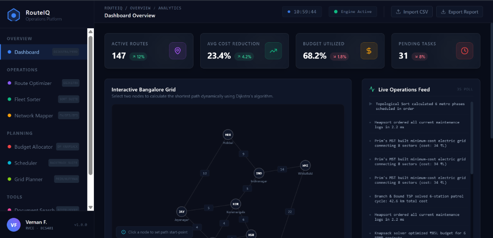

# RouteIQ — Intelligent Operations Platform

RouteIQ is a professional-grade logistics, municipal engineering, and urban operations management web application. It operates fully in-browser with zero external backend dependencies. All data, graph visualizations, heap trees, and dynamic programming matrices are calculated and animated in real-time.



---

## 🛠️ Technology Stack & Project Scaffold

- **Framework**: React 19 + Vite (JavaScript, plain JSX, no TypeScript).
- **Styling**: TailwindCSS v3 + custom CSS scrollbars and layout resets.
- **Visualizations**: D3.js (force simulations, layouts, chart render bindings).
- **Icons**: Lucide React.

### Directory Structure
```bash
src/
  ├── algorithms/                # Pure algorithm engines returning steps arrays
  │     ├── sorting.js           # Bubble, Selection, Insertion, Merge, Quick Sort
  │     ├── graph.js             # Dijkstra, Floyd-Warshall, Warshall, Prim, DFS, BFS, Kahn
  │     ├── dp.js                # 0/1 Knapsack, Fractional, Binomial, Huffman Coding
  │     ├── backtracking.js      # N-Queens, Subset Sum, TSP B&B, Shift Assignment
  │     └── stringMatch.js       # Boyer-Moore, Horspool, Naive
  ├── components/                # Reusable UI controls, consoles, and graphs
  │     ├── Sidebar.jsx          # RouteIQ navigation and user metadata
  │     ├── Topbar.jsx           # Breadcrumbs, clocks, and action buttons
  │     ├── KPICard.jsx          # Metric cards
  │     ├── AlgoEngineLog.jsx    # Monospace developer console log
  │     ├── NetworkGraph.jsx     # SVG graph visualization (D3 coordinates)
  │     ├── SortBars.jsx         # Urgency sort bars rendering
  │     └── StepControls.jsx     # Scrubber bars for algorithms
  ├── hooks/                     # Custom hooks
  │     └── useAlgoEngine.js     # Animation playback state hooks
  ├── pages/                     # Page portals
  │     ├── Dashboard.jsx
  │     ├── RouteOptimizer.jsx
  │     ├── FleetSorter.jsx
  │     ├── NetworkMapper.jsx
  │     ├── BudgetAllocator.jsx
  │     ├── Scheduler.jsx
  │     ├── DocumentSearch.jsx
  │     ├── GridPlanner.jsx
  │     └── TicketQueue.jsx
  ├── App.jsx                    # Root router layout
  ├── main.jsx                   # React DOM mounting entrypoint
  └── index.css                  # CSS base styling & scrollbars
```

---

## 🧭 Modules & Algorithms in Detail

### 1. Dashboard Overview
*   **The Problem**: Fleet operators need a unified cockpit tracking daily routes, budget utilization, pending tasks, and real-time infrastructure event notifications.
*   **Application & Algorithms**:
    *   **Dijkstra's Pathfinding**: Models the primary Bengaluru road network using 8 localities (Hebbal, Indiranagar, Koramangala, etc.). Clicking a starting point and destination runs a Dijkstra solver, immediately trace-highlighting the shortest path in cyan/blue.
    *   **Live Events Logger**: Feeds simulated logs every 3 seconds to represent active background tasks (e.g. Heapsort runs, Knapsack allocations) executing across other modules.

### 2. Route Optimizer
*   **The Problem**: Delivery dispatch vans need to find the shortest delivery routes between 10 key localities in Bengaluru to save fuel and meet courier SLA deadlines.
*   **Application & Algorithms**:
    *   **Dijkstra's Algorithm**: Evaluates single-source shortest paths. The custom engine records step-by-step vertex relaxations, coloring visited nodes violet and the active path blue. Displays estimated travel time based on a 40 km/h average speed limit.
    *   **Floyd-Warshall**: Pre-calculates all-pairs shortest paths to show a static $10 \times 10$ distance matrix below the graph, detailing the shortest distance between any two locations.
    *   **Warshall's reachability**: Evaluates boolean path connectivity, showing whether a path exists between any two localities.

### 3. Fleet Sorter
*   **The Problem**: Warehouse operators need to arrange a fleet of 30 loaded vehicles in dispatch priority sequence. The priority score is computed dynamically based on: $\text{Urgency} \times \text{Cargo Weight} \times \text{Route Distance}$.
*   **Application & Algorithms**:
    *   **Sort Algorithms**: Compares **Bubble**, **Selection**, **Insertion**, **Merge**, and **Quick Sort** side-by-side using the same unsorted input.
    *   **Visualizer**: Renders 30 vertical bars colored from green (low priority) to red (high priority). Compares elements (yellow) and swaps them (red), converting sorted sections to teal.
    *   **Performance Metrics**: Compares comparisons, swaps/shifts, and array accesses. Includes a D3 bar chart displaying the theoretical/average operations count for N=30.

### 4. Network Mapper
*   **The Problem**: Transport planners need to evaluate connection structures, calculate topological execution timelines for civil construction dependencies, and audit connectivity.
*   **Application & Algorithms**:
    *   **Floyd-Warshall (All-Pairs Paths)**: Animates the distance relaxation cell-by-cell. Renders cell updates on a color-interpolated distance heatmap.
    *   **Warshall's reachability**: Computes the transitive closure. Evaluates and colors independent connected components in the graph. Clicking an edge cycles its weight or disconnects it, updating the components in real-time.
    *   **DFS / BFS (Traversals)**: Runs DFS (using a stack) and BFS (using a queue) side-by-side from a chosen root.
    *   **Kahn's Topological Sort**: Schedules metro construction phases by evaluating prerequisite dependency constraints (directed acyclic graph), outputting a chronological timeline.

### 5. Budget Allocator
*   **The Problem**: The municipal corporation (BBMP) has a fixed capital budget (e.g., ₹100L) and must select from 10 infrastructure projects (Roads, School, Hospital, CCTV, etc.) each having a cost and a benefit score.
*   **Application & Algorithms**:
    *   **0/1 Knapsack (Dynamic Programming)**: Fills a DP matrix row-by-row. Animates cell selection and traces backward to highlight the selected projects in green. Support overrides (force-include / force-exclude).
    *   **Memory Functions**: Implements top-down memoization, graying out/blanking cells that are skipped by the recursion branch.
    *   **Fractional Knapsack (Greedy)**: Greedy ratio-packing algorithm that divides projects if budget remains, illustrating the efficiency gap between 0/1 and Fractional packing.
    *   **Pascal's Triangle (Binomial Coefficient)**: Computes the combinatorics of selecting $k$ projects from $10$ candidates ($C(10, k)$) using a Pascal table.

### 6. Scheduler
*   **The Problem**: City managers need to schedule events at municipal venues without overlaps, solve patrol paths, and assign shifts.
*   **Application & Algorithms**:
    *   **N-Queens Backtracking**: Places $N$ events ($N = 4 \text{ to } 8$) in an $N \times N$ calendar grid (Venue vs Time Slot). Animates placement, highlights conflicts in red, and demonstrates backtracking by removing events.
    *   **Subset Sum**: Evaluates combination subsets of project costs that match a target grant sum.
    *   **TSP (Branch & Bound)**: Resolves the shortest routing cycle for 6 fire stations. Shows bounding calculations and prunes branches that exceed the current best cost.
    *   **Assignment Problem**: Matches 5 workers to 5 shifts based on a cost matrix, rendering matching paths.

### 7. Document Search
*   **The Problem**: Archives managers need to search through large civic record meeting minutes for pattern keywords.
*   **Application & Algorithms**:
    *   **Boyer-Moore / Horspool / Naive String Match**: Slides pattern inputs under the document text. Visualizes bad-character and good-suffix table shifts.
    *   **Query Presorting**: Compares linear scanning against sorted binary search for 20 query terms, measuring search comparison counts.

### 8. Grid Planner
*   **The Problem**: Utility engineers need to connect residential sectors with minimum cable laying costs and compress log files.
*   **Application & Algorithms**:
    *   **Prim's MST**: Finds the minimum spanning tree of a sector grid. Animates crossing edges, outlines explored cuts, and sums running cable laying costs.
    *   **Huffman Coding**: Compresses transmission logs. Animates priority queue merges from the bottom up, outputting compression ratios and binary codes.

### 9. Ticket Queue
*   **The Problem**: Municipal ticket intakes (Sewage, Potholes, Water) arrive continuously and must be served in order of priority.
*   **Application & Algorithms**:
    *   **Heap Priority Queue**: Ingests tickets every 4 seconds. Visualizes the queue as a binary tree. Animates insert bubble-ups and serving sift-downs.
    *   **Heapsort**: Performs sorting on the active queue.

---

## 🚀 Live Access

The application is compiled, optimized, and hosted live on GitHub Pages. You can run and explore the platform directly at:
👉 **[vernan06.github.io/RouteIQ](https://vernan06.github.io/RouteIQ/)**
